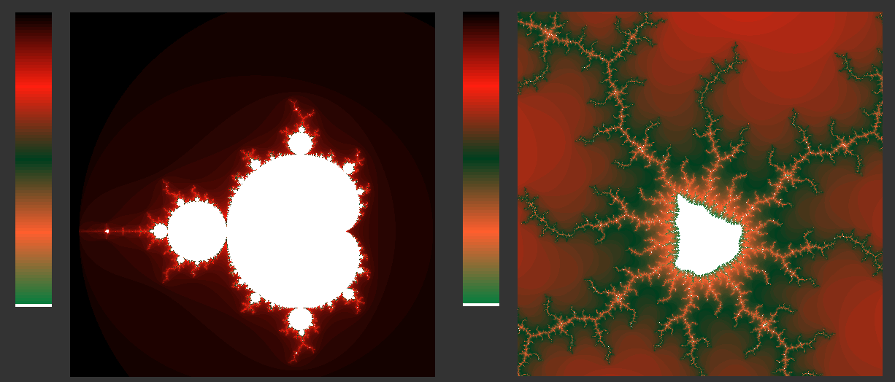
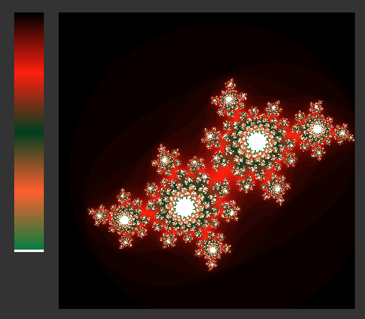
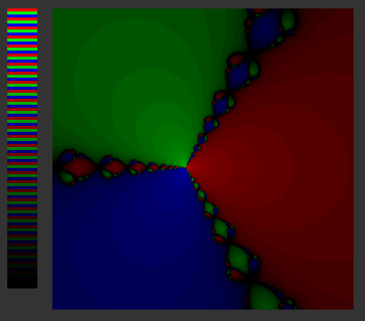

# [fract'ol]

*This project has been created as part of the 42 curriculum by nraatika.*

---

## Goal

Create an "infinitely" zoomable image of a few well-known fractal sets such as the Mandelbrot set and the Julia sets, in **C** using the **minilibX** graphics library.

## Compilation

To compile the project, run the following command in the root directory:

```bash
make bonus
./fractol m
```

## Implementation details

The fractal images result from mapping each pixel on screen to a **complex number** *c*,  and mapping the result of repeat iterations of some function with that *c* as a parameter to some colors. To achieve this, I needed to implement the rudimentary operations for complex numbers: **addition**, **subtraction**, **multiplication** and **division**. I also implemented a function to calculate the **absolute value** of a complex number, which is useful in this specific setting.

### Complex math and notations

The explanations below will contains some math notations that everyone might not be familiar with, so a quick primer

| Math notation                                                     | Read out loud                                                            | what it means                                                                                                                               |
| ----------------------------------------------------------------- | ------------------------------------------------------------------------ | ------------------------------------------------------------------------------------------------------------------------------------------- |
| $c, z \in \mathbb{C}$                                             | 'c and z in C'                                                           | "`c` and `z` belong to the group 'Complex numbers'", <br>"`c` and `z` are complex numbers"                                                  |
| $\forall n$                                                       | 'for all n'                                                              | "whatever statement that comes before or after applies no matter which `n` you choose"                                                      |
| $z \in \mathbb{C} \iff z = x + y\mathrm{i} \| x,y \in \mathbb{R}$ | 'z in c is equivalent to z is x plus y i where x and y are real numbers' | "`z` is a complex number is the same as `z` is the sum of `x` plus `y` times the imaginary unit **i**, where `x` and `y` are real numbers " |

With notation out of the way, here's a quick summary of the arithmetic you can do with complex numbers, starting with the most important one:

- complex identity: $\mathrm{i} \cdot \mathrm{i} = -1$
- addition: $z_{1} + z_{2} = (x_{1} + x_{2}) + (y_{1}+y_{2})\mathrm{i}$
- subtraction: $z_{1} - z_{2} = (x_{1} - x_{2}) + (y_{1}-y_{2})\mathrm{i}$
- multiplication: $z_{1} \cdot z_{2} = (x_{1} \cdot x_{2} - y_{1} \cdot y_{2}) + (x_{1} \cdot y_{2} + y_{1} \cdot x_{2}) \mathrm{i}$
- division:

$$
\displaystyle
\begin{aligned}
\frac{z_1}{z_2} &= \frac{a + bi}{c + di} \\
&= \frac{a + bi}{c + di} \cdot \frac{c - di}{c - di} \\
&= \frac{(ac + bd) + (bc - ad)i}{c^2 + d^2} \\
&= \left( \frac{ac + bd}{c^2 + d^2} \right) + \left( \frac{bc - ad}{c^2 + d^2} \right)i
\end{aligned}
$$

As you can see, addition and subtraction are easy, multiplication is manageable, and division is very complicated. But in the end, it boils down to addition, subtraction and multiplication of real numbers, so it's enough to implement once and forget about it after, and just treat complex numbers exactly as we would a `float` or an `int`. Luckily we only need addition, subtraction and multiplication in most cases. With those functions in hand, we can go about visualizing our fractal sets.

### The Mandelbrot set

is defined as the set of points *c*, for which the sequence $z_{n+1} = z_{n} \cdot z_{n} + c, z, c \in \mathbb{C}$ remains bounded however long you repeat: $|z_{n}| < 2 , \forall n$, when $z_{0} = 0$ . To make a more interesting picture, and because analytically solving whether something will remain bounded or not is too much for my math skills at least, we do the following

- set $z_{0} = 0, n= 0$
- set $z_{n+1} = z_{n} \cdot z_{n} + c$
  - if  $|z_{n+1}| < 2$  and $n+1 < MAX$
    - ++$n$
    - repeat
  - else
    - break
- return $n$

### Colors

This way, we get either $MAX$ back, which corresponds to being inside the set, or we get some $n < MAX$, which tells us how fast we escaped from the set, ie how close to the boundary we were. If you map this **n** to a suitable scale, you get an interesting picture: I choose white for the 'inside the set' color, and a two-peak triangle to show different depths of the fractal. Below is the standard zoom and a very zoomed-in screenshot to show off the colors.



### The Julia sets

These are very similar to the Mandelbrot sets, the only difference is that we map the screen pixel to $z_{0}$ instead of $c$, and read $c$ as a parameter when starting the program. So for example

```bash
./fractol j -0.4 0.6
```

will show the Julia set with $c = -0.4 + 0.6\mathrm{i}$.



### Newtons fractal

As one of the bonuses, we were asked to implement one more fractal set. I chose something slightly different than the previous two: both Mandelbrot and Julia sets map whether a sequence *diverges* or not (and how quickly it does). But you can also create fractal patterns on sequences that *converge* to different values. The one I chose was solving a third degree polynomial function with **Newton's algorithm**, with each pixel representing the starting point of the algorithm in the complex plane. Newtons algorithm is a version of gradient descent, and the sequence it creates is the following:

$$
z_{n+1} = z_{n} -\frac{f(z_{n})}{f'(z_{n})}
$$

There are some restraints on which kinds of functions this will produce an interesting image for, but I chose to make just a simple example:

$$
\begin{aligned}
f(z) &= z^{3} - 1 \\
f'(z) &= 3z^{2}
\end{aligned}
$$

This $f(z)$ has the known solutions:
$s_{1} = 1 , s_{2} = -0.5 + \frac{\sqrt{ 3 }}{2}\mathrm{i} , s_{3} = -0.5 - \frac{\sqrt{ 3 }}{2}\mathrm{i}$

My color-coding algorithm here becomes "repeat Newtons's algorithm until you're arbitrarily close to one of the known solutions":

- set $z_{0} = z, n= 0$ from the pixel in question
- calculate $f(z_{n})$ and $f'(z_{n})$
- set $z_{n+1} = z_{n} -\frac{f(z_{n})}{f'({z_{n})}}$
  - if  $\min\limits_{i}(|z_{n+1} - s_{i}|) > \epsilon$ , and $n+1 < MAX$
    - ++$n$
    - repeat
  - else
    - break
- return $3n + i$, where $i$ is the index that triggered coming out of the loop 

### Colors

I chose to represent each solution with a primary color, and simply make it darker the more iterations it took to reach it. Below is a sample of the output. The patterns are less interesting than the "real" fractal ones, but this has the benefit that the patterns repeat even when zooming out, rather than only when zooming in. Also because this is performing quite heavy computations (including a dreaded division of complex numbers), I had to pull the $MAX$ value down a lot compared to the earlier fractals to have any kind of smoothness left.

### Usage

```bash
./fractol n
```


